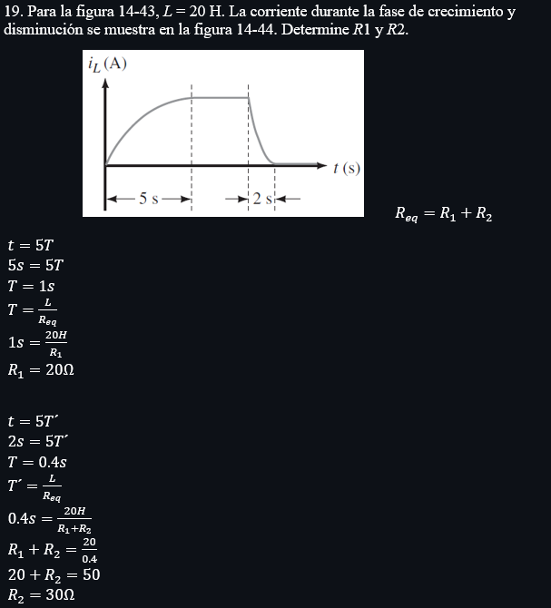
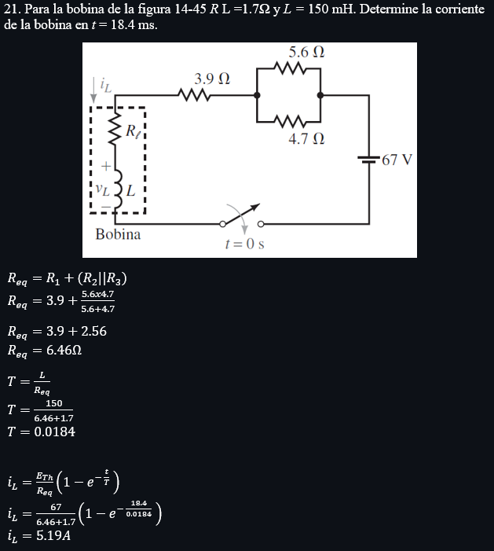
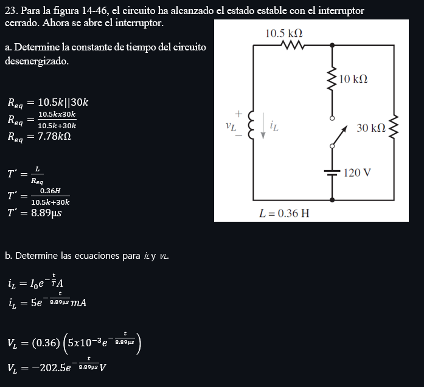
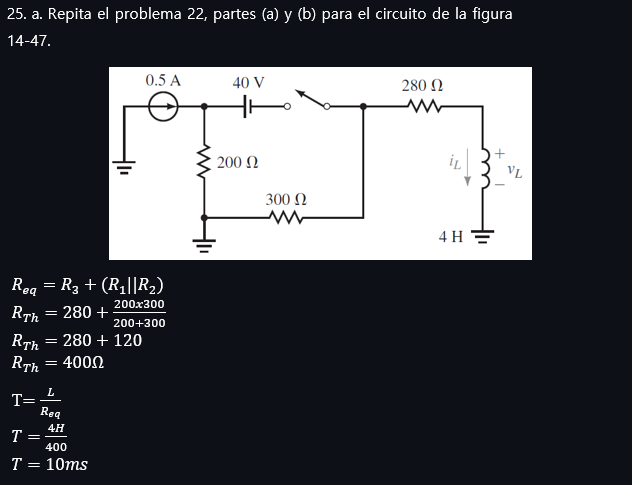
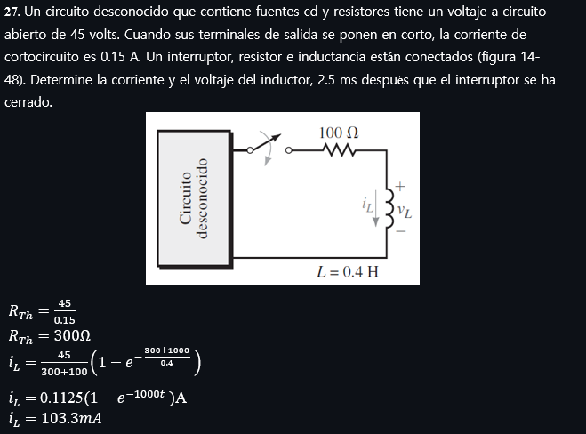

# InformeTarea7

☻ Objetivos Generales:

* 

☻ Objetivos Específicos:

2. Marco Teorico 

3. EXPLICACIÓN Y RESOLUCIÓN DE EJERCICIOS PROBLEMAS

Capitulo 14

Capitulo 15

4. VDEO:

5. CONCLUSIONES

*

6. BIBLIOGRAFÍA

Allan.H.Wilhelm.C.(2008). Análisis de circuitos teoría y práctica. Santa Fe, México: Cengage learning editores.
