# InformeTarea7

☻ Objetivos Generales:

*Ser capaces de reconocer los Transitorio de corriente creciente y Generación de voltajes de CA a profundidad de los conceptos fundamentales.

☻ Objetivos Específicos:

*Conocer la como dar resolucion a problemas de frecuencia, periodo, amplitud y valor pico en circuitos electricos. 

2. Marco Teorico 

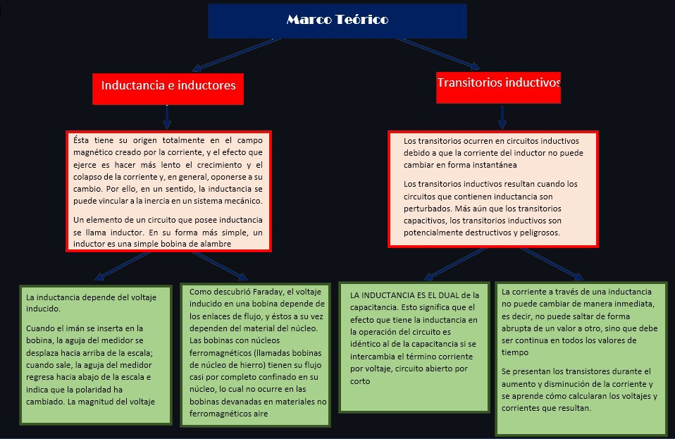

3. EXPLICACIÓN Y RESOLUCIÓN DE EJERCICIOS PROBLEMAS

Capitulo 14

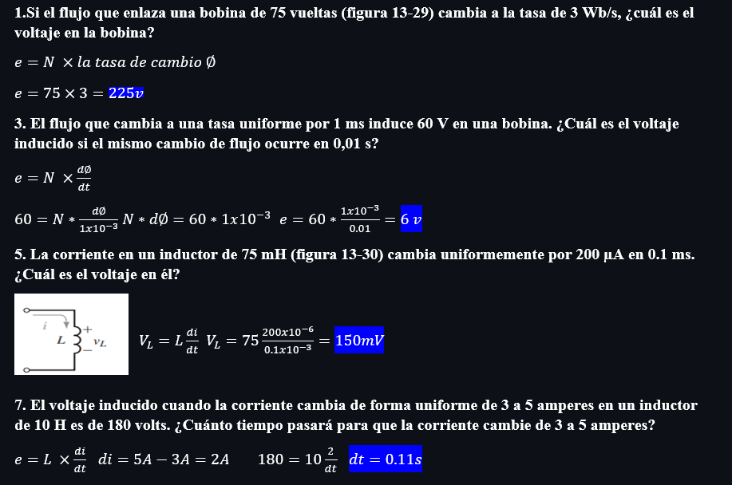

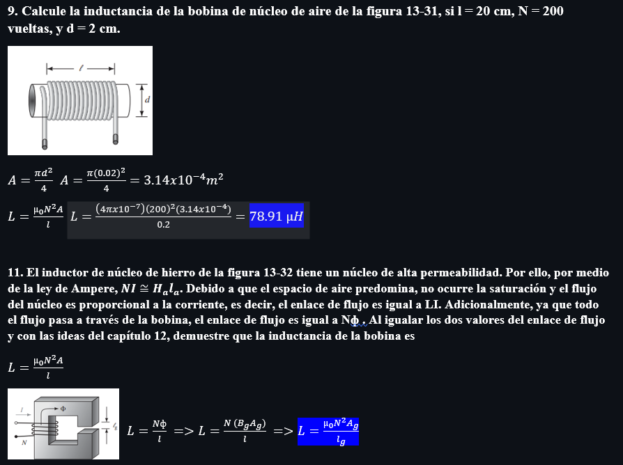

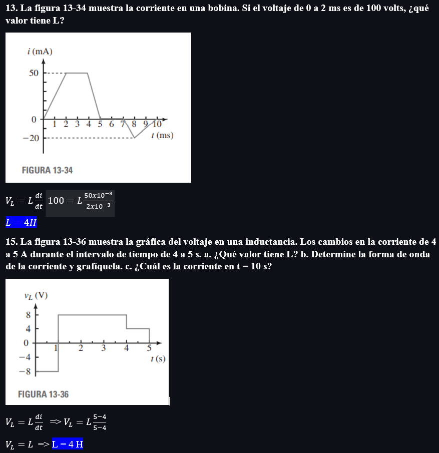

Capitulo 15

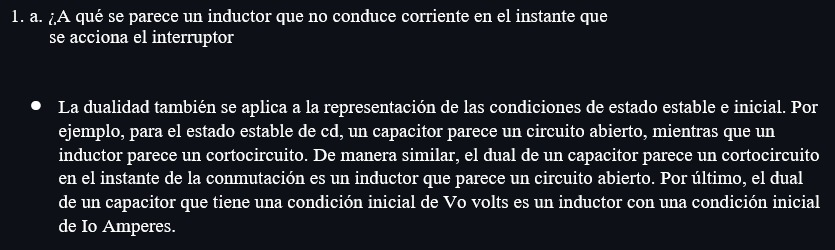

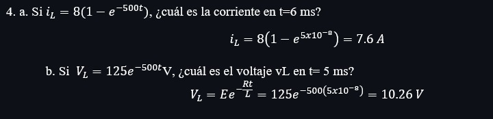

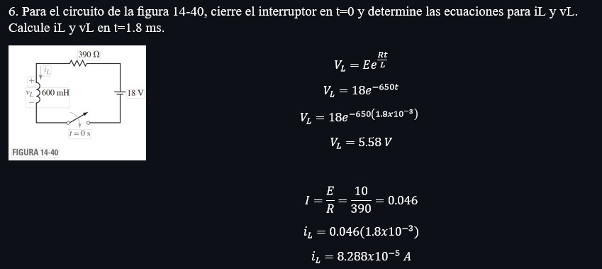

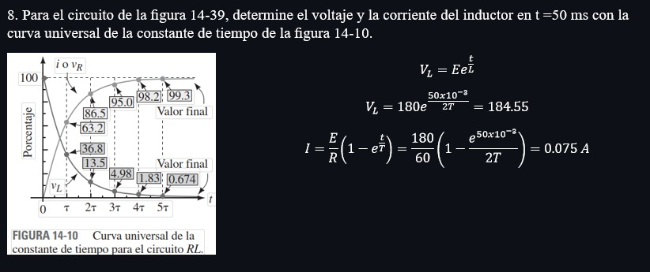

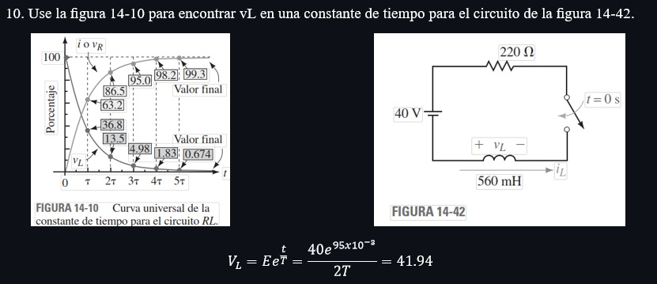

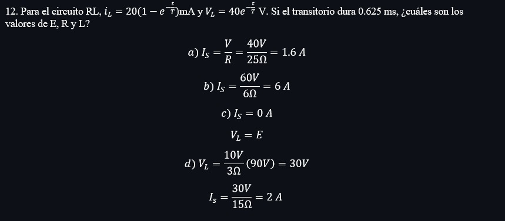

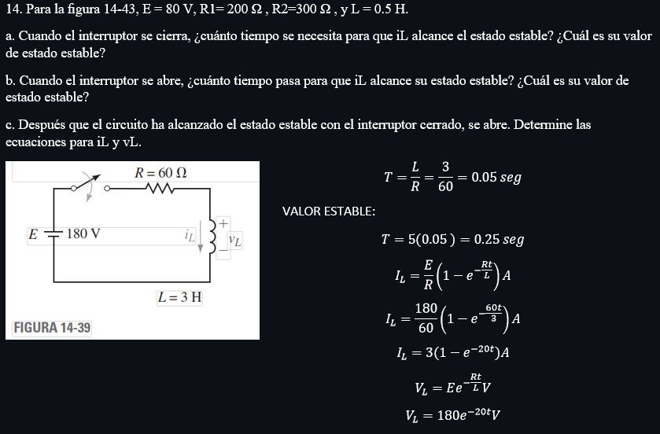

4. VDEO:

5. CONCLUSIONES

*Tras el analisis a profundidad de los conceptos de los Transitorio de corriente creciente y Generación de voltajes de CA facilitándonos los cálculos. 

*Ahora podemos dar solicion a problemas de frecuencia, periodo, amplitud y valor pico en circuitos electricos con facilidad gracias a conocer los conceptos de los mismos.

6. BIBLIOGRAFÍA

Allan.H.Wilhelm.C.(2008). Análisis de circuitos teoría y práctica. Santa Fe, México: Cengage learning editores.
